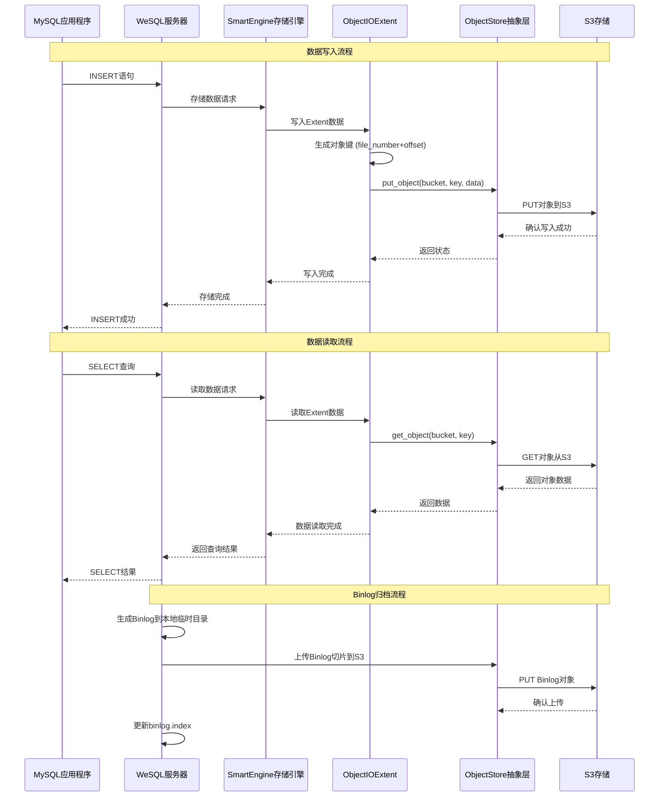
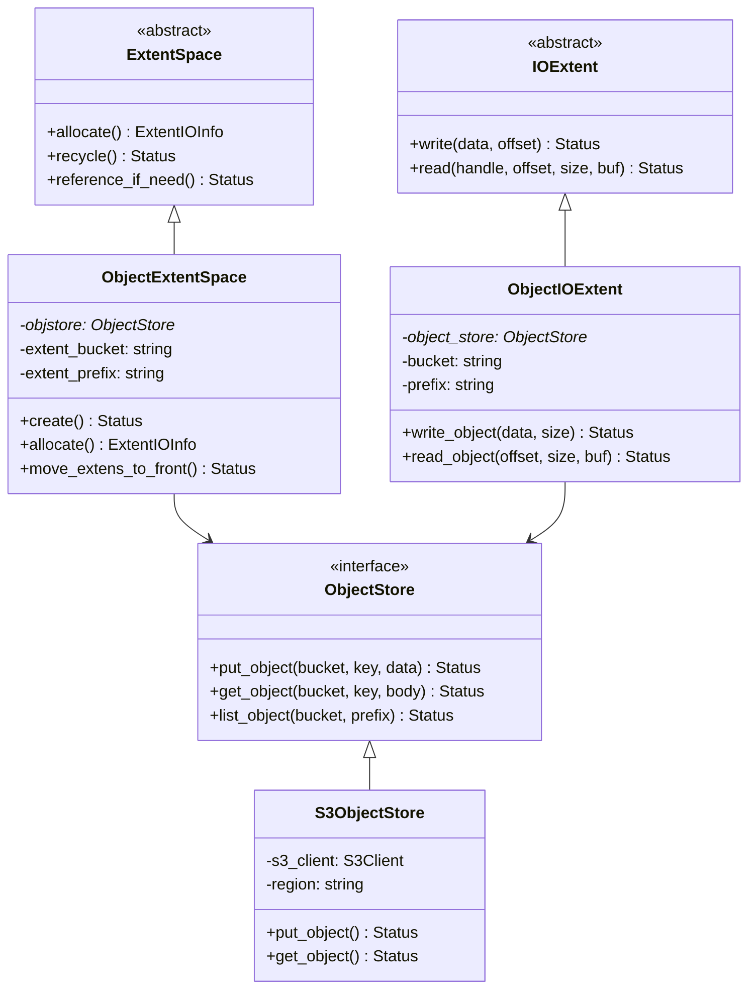
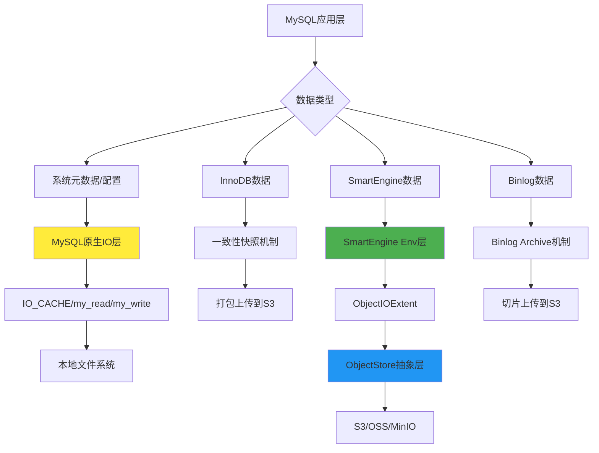
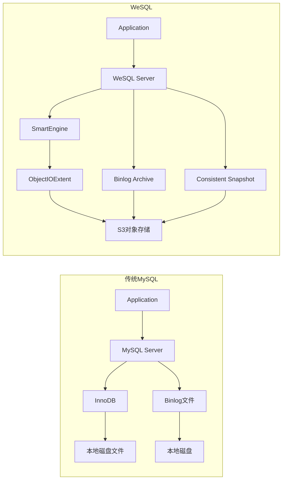
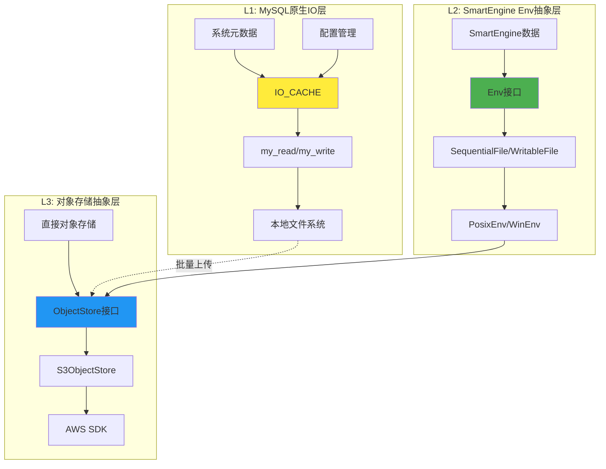

# WeSQL S3对象存储架构深度分析

## 概述

WeSQL是一个采用计算存储分离架构的创新MySQL发行版，完全基于S3（及S3兼容系统）作为存储后端。与传统MySQL不同，WeSQL将**所有**MySQL数据（包括binlogs、schemas、存储引擎元数据、WAL和数据文件）**完全**（而非部分）存储为S3中的对象。

这种架构提供了S3的11个9（99.999999999%）可靠性，显著增强了数据可靠性。WeSQL可以从一个全新的空实例开始，连接到S3，加载数据并立即开始服务，无需额外配置。

## 核心架构设计

### 1. 对象存储抽象层

WeSQL设计了统一的对象存储抽象层，支持多种云提供商：

```cpp
// include/objstore.h
class ObjectStore {
public:
  virtual ~ObjectStore() = default;
  
  // 支持的提供商判断
  inline static bool use_s3_sdk(const std::string_view &provider) {
    return provider == "aws" || provider == "minio" || provider == "r2";
  }
  
  // 核心接口
  virtual Status create_bucket(const std::string_view &bucket) = 0;
  virtual Status put_object(const std::string_view &bucket,
                           const std::string_view &key,
                           const std::string_view &data,
                           bool forbid_overwrite = false) = 0;
  virtual Status get_object(const std::string_view &bucket,
                           const std::string_view &key,
                           std::string &body) = 0;
  // ... 其他接口
};
```

### 2. 支持的对象存储提供商

- **AWS S3**: 原生支持
- **阿里云OSS**: 通过阿里云SDK
- **MinIO**: S3兼容API
- **Cloudflare R2**: S3兼容API
- **Local**: 本地文件系统模拟（测试用）

### 3. 存储层级结构

```
bucket/
├── repo_id/                    # 仓库标识符
│   ├── branch_id/              # 分支标识符
│   │   ├── binlog/             # Binlog存储
│   │   │   ├── binlog.index    # Binlog索引文件
│   │   │   ├── binlog.000001   # Binlog文件切片
│   │   │   └── ...
│   │   ├── data/               # InnoDB数据文件
│   │   │   ├── mysql/          # 系统表
│   │   │   ├── ibdata1         # 系统表空间
│   │   │   └── ...
│   │   ├── smartengine/        # SmartEngine存储引擎数据
│   │   │   ├── v1/             # 版本号
│   │   │   │   ├── database_name/
│   │   │   │   │   ├── index_id/
│   │   │   │   │   │   ├── data/    # 数据文件(.sst)
│   │   │   │   │   │   └── wal/     # WAL文件
│   │   │   │   │   └── ...
│   │   │   └── locks/          # 分布式锁
│   │   └── snapshots/          # 一致性快照
│   └── ...
```

## 技术实现细节

### 1. SmartEngine与S3集成

SmartEngine是WeSQL的核心存储引擎，完全重写以支持对象存储：

```cpp
// storage/smartengine/core/storage/io_extent.cc
class ObjectIOExtent : public IOExtent {
private:
  int write_object(const char *data, int64_t data_size) {
    std::string object_id = prefix_ + std::to_string(
        assemble_objid_by_fdfn(extent_id_.file_number, extent_id_.offset));
    
    ::objstore::Status object_status = object_store_->put_object(
        bucket_, object_id, std::string_view(data, data_size), false);
    
    if (!object_status.is_succ()) {
      SE_LOG(WARN, "io error, failed to put obj", 
             K(object_status.error_message()), K(object_id));
      return Status::kObjStoreError;
    }
    return Status::kOk;
  }
};
```

**关键特性：**
- **Extent级别存储**: 数据以extent为单位存储到S3
- **对象键命名**: 基于文件号和偏移量生成唯一对象键
- **写入优化**: 支持大对象写入和条件写入
- **读取优化**: 支持范围读取和异步IO

### 2. Binlog存储与归档

```cpp
// sql/binlog_archive.cc  
class Binlog_archive {
private:
  int archive_binlog_slice() {
    // 将binlog切片上传到S3
    std::string binlog_slice_keyid = m_binlog_archive_dir + slice_name;
    objstore::Status ss = binlog_objstore->put_object_from_file(
        std::string_view(opt_objstore_bucket), 
        binlog_slice_keyid, 
        local_slice_path);
    
    if (!ss.is_succ()) {
      LogErr(ERROR_LEVEL, ER_BINLOG_ARCHIVE_PUT_OBJECT_FROM_FILE,
             binlog_slice_keyid.c_str(), ss.error_message().c_str());
      return 1;
    }
    return 0;
  }
};
```

**Binlog处理流程：**
1. MySQL生成binlog到本地临时目录
2. Binlog archive线程将文件切片上传到S3
3. 维护binlog.index索引文件
4. 支持增量和全量归档
5. 恢复时从S3重构完整binlog

### 3. 一致性快照与恢复

```cpp
// sql/consistent_archive.cc
class Consistent_archive {
  int archive_innodb_data() {
    // 创建InnoDB clone
    // 打包或直接上传到S3
    if (m_innodb_tar_compression_mode != CONSISTENT_SNAPSHOT_NO_TAR) {
      // 压缩打包方式
      cmd << "tar -czf " << clone_name << " " << m_mysql_innodb_clone_dir;
      system(cmd.str().c_str());
      
      // 上传压缩包到S3
      objstore::Status ss = archive_objstore->put_object_from_file(
          std::string_view(opt_objstore_bucket), 
          clone_keyid, 
          clone_name);
    } else {
      // 直接上传目录结构到S3
      objstore::Status ss = archive_objstore->put_objects_from_dir(
          m_mysql_innodb_clone_dir,
          std::string_view(opt_objstore_bucket), 
          clone_keyid);
    }
  }
};
```

### 4. 配置参数

WeSQL引入了一系列新的配置参数：

```sql
-- 对象存储提供商
SET GLOBAL objectstore_provider = 'aws|aliyun|minio|local';

-- 对象存储区域
SET GLOBAL objectstore_region = 'us-west-2';

-- 对象存储端点（非AWS时需要）
SET GLOBAL objectstore_endpoint = 'https://s3.amazonaws.com';

-- 是否使用HTTPS
SET GLOBAL objectstore_use_https = true;

-- 存储桶名称
SET GLOBAL objectstore_bucket = 'wesql-data-bucket';

-- 仓库ID（用于多租户隔离）
SET GLOBAL repo_objectstore_id = 'wesql_repo_001';

-- 分支ID（用于分支隔离）
SET GLOBAL cluster_branch_objectstore_id = 'main_branch';
```

## 数据流架构图

上面我已经提供了系统架构的整体流程图。现在让我们看看数据流的时序图：



## SmartEngine对象存储层次结构



## WeSQL的IO架构设计策略

### 关键问题：为什么不修改MySQL原有的IO入口？

你提出了一个非常重要的问题！MySQL确实有统一的IO入口和抽象层（如`my_read`、`my_write`、`IO_CACHE`等），但WeSQL**没有简单地修改这个入口**，而是采用了**分层共存**的策略：

```cpp
// MySQL传统IO层（保留）
my_read() / my_write() / IO_CACHE 
    ↓
// SmartEngine现代化IO抽象层（新增）
Env → SequentialFile/WritableFile/RandomAccessFile
    ↓  
// 对象存储抽象层（新增）
ObjectStore → S3ObjectStore/AliyunOSSObjectStore
```

### IO层次架构分析



### 为什么采用这种策略？

1. **渐进式迁移**：保持MySQL核心功能的稳定性
2. **存储引擎隔离**：SmartEngine可以独立发展IO抽象
3. **灵活性**：不同数据类型可以选择最适合的存储方式
4. **兼容性**：最大程度保持与MySQL生态的兼容

### 具体实现分析

#### A. MySQL原生IO层保留

```cpp
// patches/mysql-server-8.0.35.patch中扩展了IO_CACHE
#ifdef WESQL_CLUSTER
class IO_cache_istream : public Basic_istream {
public:
  ssize_t read(unsigned char *buffer, size_t length) override {
    // 仍然使用my_b_read
    if (my_b_read(m_io_cache, buffer, length))
      return m_io_cache->error;
    return static_cast<longlong>(length);
  }
private:
  IO_CACHE *m_io_cache;  // MySQL原生IO_CACHE
};
#endif
```

#### B. SmartEngine现代化IO抽象

```cpp
// storage/smartengine/core/env/env.h
// 类似RocksDB的设计，更现代化的文件抽象
class Env {
public:
  virtual Status NewSequentialFile(const std::string& fname,
                                   SequentialFile*& result,
                                   const EnvOptions& options) = 0;
  virtual Status NewWritableFile(const std::string& fname,
                                 WritableFile*& result, 
                                 const EnvOptions& options) = 0;
  
  // 关键：对象存储的初始化接口
  virtual Status InitObjectStore(const std::string_view provider,
                                 const std::string_view region,
                                 const std::string_view* endpoint,
                                 bool use_https,
                                 const std::string_view bucket) = 0;
};
```

#### C. 对象存储抽象层

```cpp
// include/objstore.h - 完全新增的抽象层
class ObjectStore {
public:
  virtual Status put_object(const std::string_view& bucket,
                           const std::string_view& key,
                           const std::string_view& data) = 0;
  virtual Status get_object(const std::string_view& bucket,
                           const std::string_view& key,
                           std::string& body) = 0;
};
```

## 源码修改分析

### 1. 核心修改点

#### A. CMake构建系统集成

```cmake
# CMakeLists.txt 
OPTION(WITH_WESQL "use wesql mode" ON)
INCLUDE(aws_sdk_cpp)  # AWS SDK集成
INCLUDE(aliyun_oss_sdk)  # 阿里云OSS SDK集成

# 添加对象存储库
MYSQL_CHECK_OBJSTORE_S3()
MYSQL_CHECK_OBJSTORE_ALIYUN_OSS()
```

#### B. 系统变量扩展

```cpp
// patches/mysql-server-8.0.35.patch
// 新增系统变量
static Sys_var_charptr Sys_objstore_provider(
    "objectstore_provider",
    "The provider of object store",
    READ_ONLY NON_PERSIST GLOBAL_VAR(opt_objstore_provider),
    CMD_LINE(REQUIRED_ARG), IN_FS_CHARSET, DEFAULT("local"));
```

#### C. 存储引擎集成

```cpp
// storage/smartengine/plugin/se_plugin.cc
if (opt_table_on_objstore && opt_serverless) {
  // 初始化对象存储
  common::Status status = main_opts.env->InitObjectStore(
      std::string_view(opt_objstore_provider),
      std::string_view(opt_objstore_region),
      opt_objstore_endpoint ? &endpoint : nullptr,
      opt_objstore_use_https,
      opt_objstore_bucket,
      se_tbl_options.cluster_id,
      opt_objstore_lease_lock_timeout);
}
```

### 架构决策分析：为什么不直接修改MySQL IO入口？

#### 方案对比

| 方案 | WeSQL采用 | 替代方案 | 优缺点分析 |
|------|----------|----------|-----------|
| **分层混合** | ✅ 是 | 直接修改MySQL IO | **优点**: 稳定性好、兼容性强、渐进迁移<br>**缺点**: 架构复杂、维护成本高 |
| **完全替换** | ❌ 否 | 重写MySQL IO层 | **优点**: 架构统一、性能优化空间大<br>**缺点**: 风险高、生态兼容性差 |
| **存储引擎层** | ✅ 部分 | 只在存储引擎实现 | **优点**: 影响范围可控<br>**缺点**: 无法覆盖系统级数据 |

#### 具体实现策略

```cpp
// 1. MySQL核心仍使用原生IO（保持稳定性）
// sql/log.cc, sql/table.cc 等核心模块
FILE* file = fopen(path, "r");
my_read(file, buffer, size, MYF(0));

// 2. SmartEngine使用现代化IO抽象
// storage/smartengine/core/env/env_posix.cc
Status PosixEnv::NewWritableFile(const std::string& fname,
                                 WritableFile*& result,
                                 const EnvOptions& options) {
  int fd = open(fname.c_str(), flags, 0644);
  result = new PosixWritableFile(fname, fd, options);
}

// 3. 对象存储通过专门的抽象层
// mysys/objstore/s3.cc
Status S3ObjectStore::put_object(const std::string_view& bucket,
                                 const std::string_view& key,
                                 const std::string_view& data) {
  return s3_client_.PutObject(request);
}
```

#### 数据流向映射

| 数据类型 | MySQL原生路径 | WeSQL路径 | 说明 |
|---------|---------------|-----------|------|
| **系统表** | my_read/my_write → 本地磁盘 | IO_CACHE → 一致性快照 → S3 | 通过快照机制异步上传 |
| **InnoDB数据** | innodb_file_io → 本地文件 | InnoDB Clone → tar压缩 → S3 | 批量打包上传 |
| **SmartEngine数据** | N/A | Env → ObjectIOExtent → S3 | 直接对象存储，实时读写 |
| **Binlog** | IO_CACHE → 本地文件 | Binlog Archive → 切片 → S3 | 异步归档到S3 |
| **配置文件** | my_read → 本地文件 | **保持原有方式** | 不需要持久化到S3 |

### 2. 关键代码路径

| 功能模块 | 源码路径 | 主要职责 | IO层级 |
|---------|----------|----------|--------|
| 对象存储抽象层 | `include/objstore.h` <br> `mysys/objstore/` | 统一对象存储接口定义和实现 | L3: 对象存储层 |
| SmartEngine集成 | `storage/smartengine/core/storage/` | 存储引擎与对象存储的集成 | L2: Env抽象层 |
| Binlog归档 | `sql/binlog_archive.cc` <br> `sql/binlog_archive_replica.cc` | Binlog到S3的归档和复制 | L1: MySQL原生IO |
| 一致性快照 | `sql/consistent_archive.cc` <br> `sql/consistent_recovery.cc` | 快照创建和恢复机制 | L1→L3: 混合路径 |
| 配置管理 | `patches/mysql-server-8.0.35.patch` | 新增配置参数和系统变量 | L1: MySQL原生IO |

### 3. 传统MySQL vs WeSQL对比



## 性能优化策略

### 1. 缓存机制

```cpp
// storage/smartengine/core/storage/io_extent.cc
if (PersistentCache::get_instance().is_enabled()) {
  // 写入持久化缓存
  PersistentCache::get_instance().insert(extent_id_,
                          Slice(data, data_size),
                          true /*write_process*/,
                          nullptr /*handle*/);
}
```

### 2. 异步IO支持

```cpp
// ObjectIOExtent支持异步读取
int ObjectIOExtent::async_read(util::AIOHandle *aio_handle, 
                               int64_t offset, 
                               int64_t size, 
                               char *buf, 
                               common::Slice &result) {
  // 异步读取实现
  return fill_aio_info(aio_handle, offset, size, aio_info);
}
```

### 3. 批量操作优化

```cpp
// 批量删除对象
virtual Status delete_objects(
    const std::string_view &bucket,
    const std::vector<std::string_view> &object_keys) = 0;
```

## 高可用性设计

### 1. 分布式锁机制

```cpp
// storage/smartengine/core/objstore/objstore_layout.cc
std::string get_lease_lock_key(const std::string_view cluster_id) {
  return util::make_lock_prefix(cluster_id.data()) + "lease_lock";
}
```

### 2. 多AZ支持

- 支持跨可用区的S3存储
- 自动故障转移机制
- 数据复制和同步

### 3. 备份恢复策略

- **增量备份**: 基于binlog的增量备份
- **全量快照**: 一致性快照机制
- **点时间恢复**: PITR支持
- **跨区域复制**: 支持多地域备份

## 部署模式

### 1. Serverless模式

```yaml
# 配置示例
serverless: on
objectstore_provider: aws
objectstore_region: us-west-2
objectstore_bucket: wesql-serverless-data
objectstore_use_https: true
```

### 2. 集群模式

```yaml
# 集群配置
raft_replication: on
cluster_info_on_objectstore: on
objectstore_lease_lock_timeout: 30
```

## 监控与运维

### 1. 关键指标

- **对象存储延迟**: S3操作响应时间
- **带宽使用**: 上传/下载带宽统计
- **错误率**: 对象存储操作失败率
- **缓存命中率**: 本地缓存效果

### 2. 日志记录

```cpp
// 详细的对象存储操作日志
SE_LOG(WARN, "io error, failed to put obj", 
       K(object_status.error_message()), K(object_id));
```

## 架构设计深度思考

### WeSQL IO架构的核心洞察

**关键问题回答**: WeSQL**没有修改MySQL的统一IO入口**，而是采用**分层共存**策略的根本原因：

#### 1. **风险控制优先**
```
修改MySQL核心IO = 高风险 高回报
分层扩展IO = 低风险 渐进收益
```

#### 2. **生态兼容性考量**
- MySQL有庞大的生态系统（工具、监控、备份等）
- 修改底层IO可能破坏现有工具的兼容性
- WeSQL选择最小侵入式改造

#### 3. **技术债务管理**
```cpp
// 如果修改MySQL IO入口，需要处理：
- 所有使用my_read/my_write的代码
- PSI性能监控接口
- 错误处理和重试机制  
- 字符集和编码处理
- 缓存和缓冲区管理
// 成本极高，风险极大
```

### 三层IO架构的智慧



**每层的独特价值**:
- **L1层**: 保持MySQL生态兼容，处理系统级数据
- **L2层**: 现代化文件抽象，支持高级特性（Direct IO、异步IO）
- **L3层**: 云原生存储，支持多云和对象存储

### 实际影响分析

#### 优势
1. **稳定性**: MySQL核心功能不受影响
2. **可维护性**: 各层职责清晰，便于独立演进
3. **扩展性**: 可以支持更多存储后端
4. **渐进性**: 可以逐步迁移更多功能到对象存储

#### 挑战  
1. **复杂性**: 三层架构增加了理解和维护成本
2. **性能**: 多层转换可能带来额外开销
3. **一致性**: 需要保证多层之间的数据一致性
4. **监控**: 需要在多个层级进行性能监控

### 未来演进可能

```
当前: MySQL IO + SmartEngine IO + ObjectStore
 ↓
未来: 逐步将更多MySQL IO迁移到ObjectStore
 ↓ 
最终: 统一的云原生IO抽象层
```

## 总结

WeSQL通过**分层共存的IO架构**实现了完整的S3存储支持，这是一个深思熟虑的工程决策：

### 🏗️ **核心技术创新**
1. **三层IO架构**: MySQL原生层 + SmartEngine抽象层 + 对象存储层
2. **混合存储模式**: 不同数据类型采用最适合的存储方式  
3. **渐进式迁移**: 最小化风险的同时最大化收益
4. **生态兼容性**: 保持与MySQL工具链的完美兼容

### 📊 **架构优势**
- **稳定性**: 核心功能不受影响，降低故障风险
- **灵活性**: 支持多种云提供商和存储后端
- **可扩展性**: 可以独立优化各层性能
- **兼容性**: 现有MySQL应用无需修改

### 🚀 **创新意义**
WeSQL证明了**不需要推翻重来**就能实现云原生改造。这种**工程智慧**对于大型系统的现代化改造具有重要的借鉴意义，是真正的**渐进式创新**典范。

这种计算存储分离的架构不仅提供了极高的数据可靠性，还实现了真正的云原生数据库解决方案，非常适合现代云环境下的应用部署。
