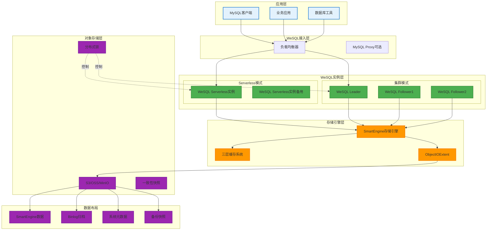
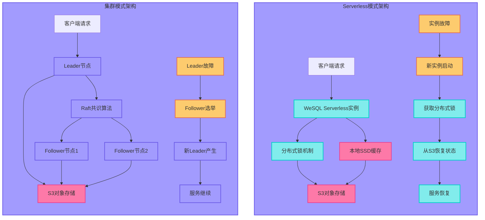
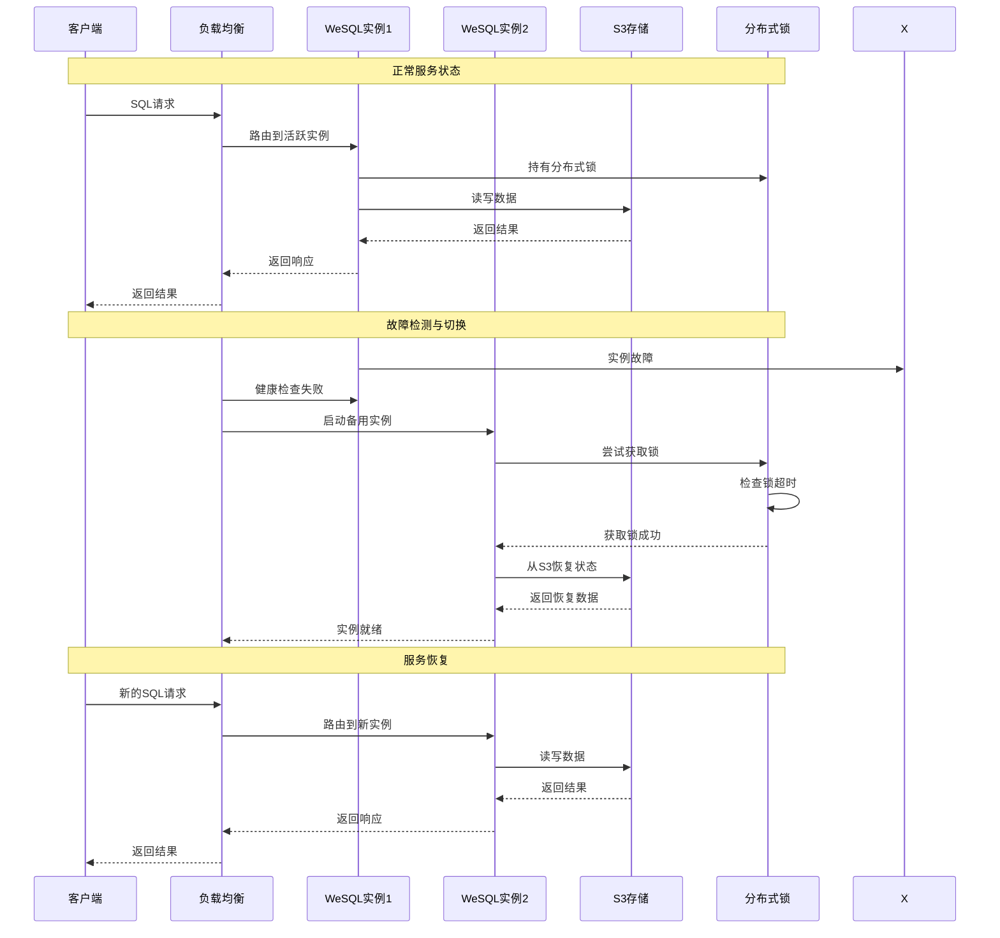
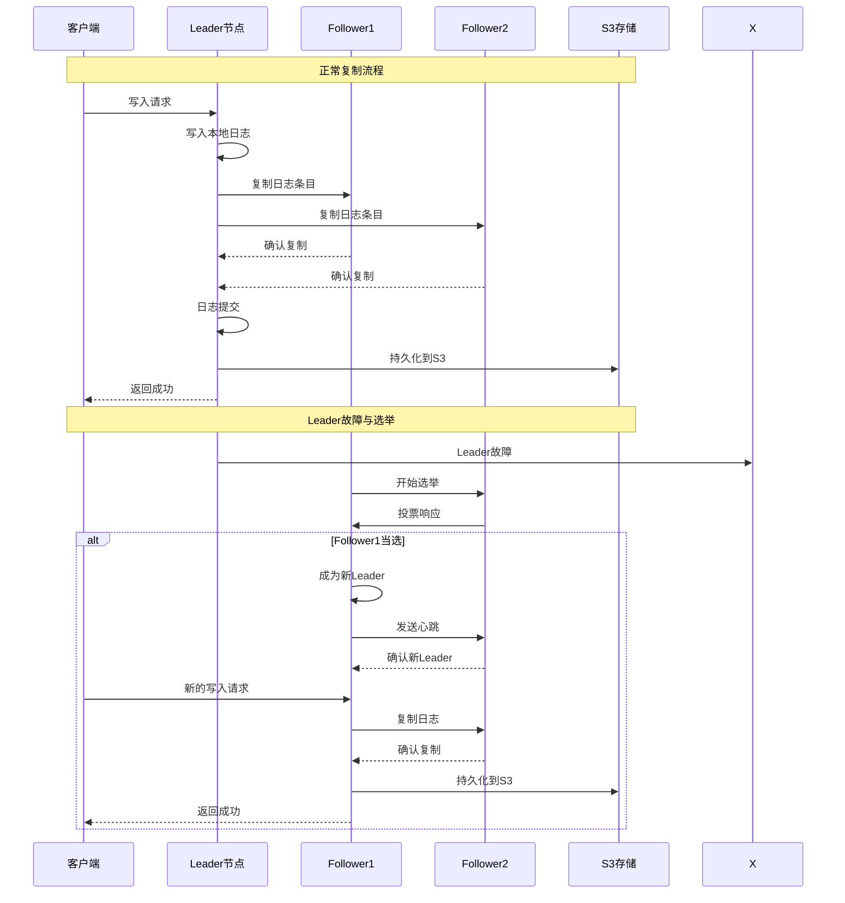
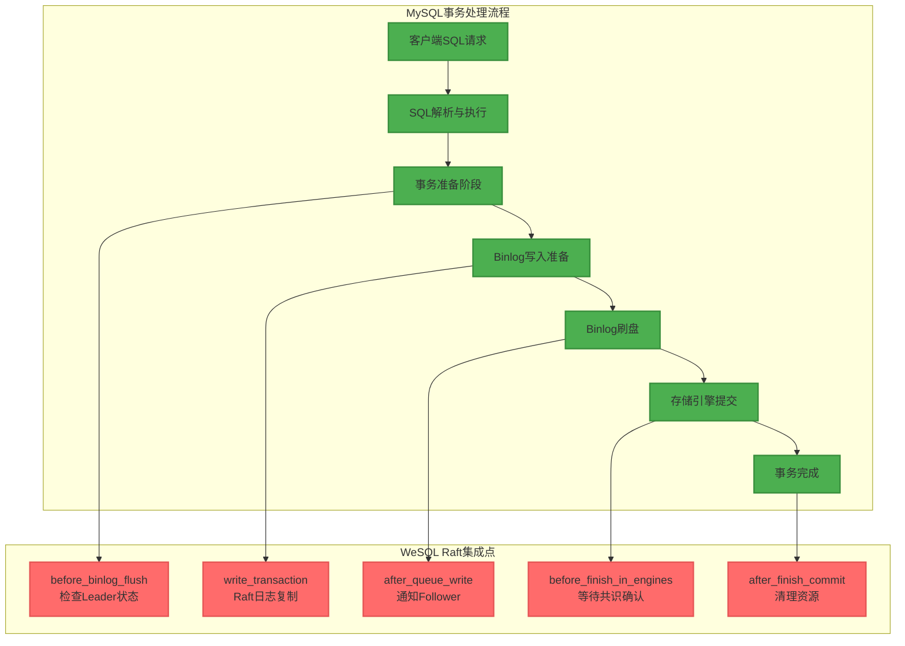
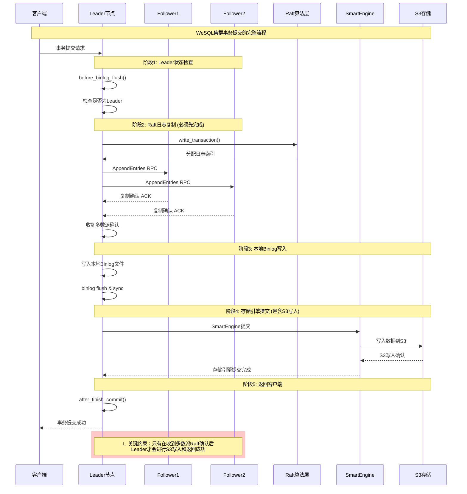
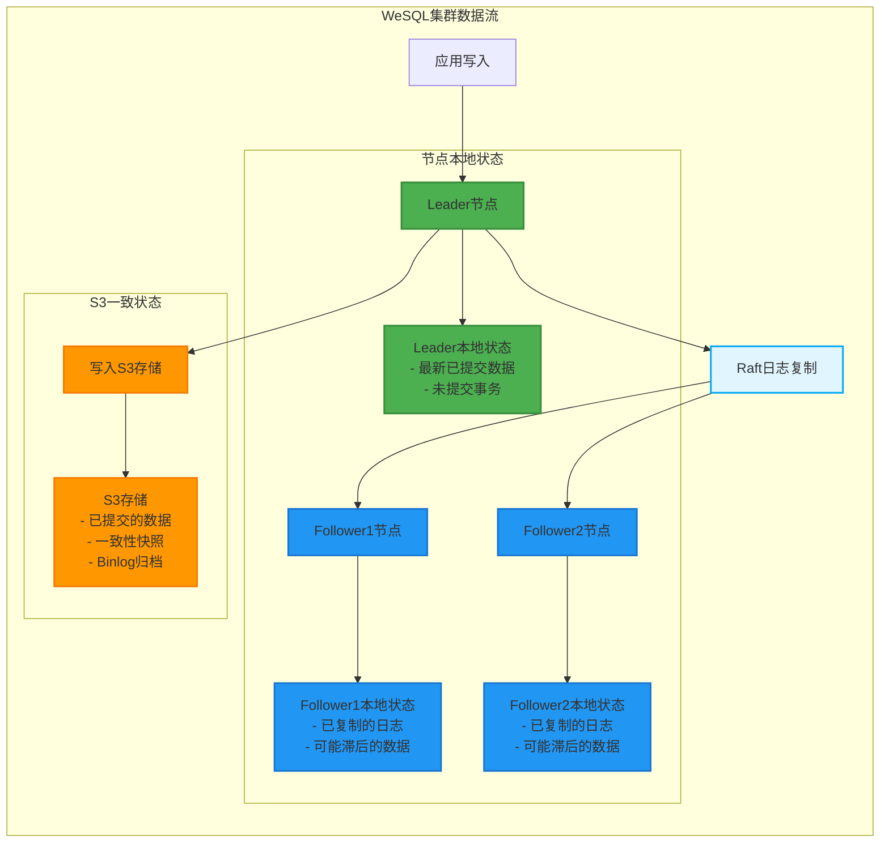
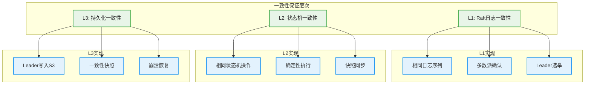

# WeSQL全局架构与高可用方案深度解析

## 概述

WeSQL是基于**计算存储分离**架构设计的云原生MySQL发行版，支持两种核心部署模式：**Serverless模式**和**集群高可用模式**。本文档从全局视角深度解析WeSQL的架构设计和高可用保证机制。

### 核心架构特征

- **🏗️ 计算存储分离**: 完全基于S3对象存储，实现计算与存储的物理解耦
- **🔄 多模式部署**: 支持Serverless和集群两种模式，适应不同场景需求
- **⚡ 云原生设计**: SmartEngine存储引擎专为对象存储优化
- **📊 一致性保证**: 通过分布式锁和共识算法确保数据一致性
- **🔧 自动故障恢复**: 支持跨机器、跨AZ的快速恢复

## WeSQL全局架构设计

### 整体架构概览



### 架构分层解析

| 层级 | 组件 | 主要职责 | 高可用特性 |
|------|------|----------|-----------|
| **应用层** | MySQL客户端/业务应用 | 数据库访问和业务逻辑 | 多实例连接、故障转移 |
| **接入层** | 负载均衡器/代理 | 流量分发、故障检测 | 健康检查、自动切换 |
| **实例层** | WeSQL实例 | MySQL服务、事务处理 | 主备切换、集群共识 |
| **存储引擎层** | SmartEngine | 数据存储、缓存管理 | 无状态设计、快速恢复 |
| **对象存储层** | S3兼容存储 | 持久化存储、数据保护 | 多副本、跨AZ复制 |

## WeSQL部署模式深度对比

### Serverless模式 vs 集群模式



### 模式对比分析

| 对比维度 | Serverless模式 | 集群模式 | 推荐场景 |
|---------|---------------|----------|----------|
| **一致性保证** | 分布式锁(S3对象) | Raft共识算法 | Serverless适合单实例；集群适合多实例并发 |
| **故障恢复时间** | 分钟级 | 秒级 | 集群模式恢复更快 |
| **资源利用** | 按需分配 | 固定资源池 | Serverless成本更低 |
| **数据同步** | 无需同步 | Leader->Follower | 集群需要处理数据同步 |
| **复杂度** | 相对简单 | 较复杂 | Serverless运维更简单 |
| **可扩展性** | 自动扩缩容 | 手动扩展 | Serverless弹性更好 |

## 高可用架构设计

### Serverless模式高可用机制



#### 关键机制说明

1. **分布式锁保护**: 基于S3对象的lease_lock确保同一时刻只有一个实例提供服务
2. **健康检查**: 负载均衡器持续检测实例状态
3. **自动故障转移**: 故障检测后自动启动备用实例
4. **快速状态恢复**: 新实例从S3快速恢复到最新状态

### 集群模式高可用机制



#### 集群共识机制

WeSQL采用**Raft共识算法**确保集群数据一致性：

```cpp
// plugin/raft_replication/raft/consensus/algorithm/paxos.cc
uint64_t Paxos::replicateLog_(LogEntry& entry, const bool needLock) {
  // 1. 检查Leader状态
  auto state = state_.load();
  if (state != LEADER) {
    return 0;  // 只有Leader可以复制日志
  }
  
  // 2. 设置任期和索引
  entry.set_term(currentTerm_.load());
  auto logIndex = localServer_->writeLog(entry);
  entry.set_index(logIndex);
  
  // 3. 并行复制到Followers
  for (auto& follower : followers_) {
    follower->sendAppendEntries(entry);
  }
  
  // 4. 等待多数派确认
  if (waitForMajorityAck(logIndex)) {
    commitLog(logIndex);
    return logIndex;
  }
  
  return 0;
}
```

## 数据同步与一致性保证

### 🤔 关键问题：从节点会从主节点同步不同数据吗？

**答案：是的，但有重要的架构区别！**

## WeSQL Raft复制机制深度技术解析

### 📋 问题1：Raft复制的是什么数据？

**答案：WeSQL Raft复制的是包含了共识事件的Binlog数据，而非Redo日志！**

#### Raft复制的具体内容

```cpp
// WeSQL在binlog中加入了专门的共识事件类型
enum Log_event_type {
  // MySQL原有事件...
  HEARTBEAT_LOG_EVENT_V2 = 41,
  
  // WeSQL新增的共识事件
  CONSENSUS_LOG_EVENT = 101,                    // 共识日志事件
  PREVIOUS_CONSENSUS_INDEX_LOG_EVENT = 102,     // 前一个共识索引事件
  CONSENSUS_CLUSTER_INFO_EVENT = 103,           // 集群信息事件
  CONSENSUS_EMPTY_EVENT = 104,                  // 空共识事件
};
```

**复制的数据结构**：

```cpp
struct ConsensusLogEntry {
  uint64_t term;          // Raft任期
  uint64_t index;         // Raft日志索引
  uint64_t flag;          // 事件标志
  uint32_t checksum;      // 校验和
  size_t buf_size;        // 数据大小
  const char* buffer;     // 包含MySQL事务操作的Binlog数据
  bool outer;             // 是否外部日志
};
```

**关键特点**：
- **不是Redo日志**：WeSQL不复制存储引擎层的Redo日志
- **是增强的Binlog**：复制的是包含共识元数据的MySQL Binlog
- **事务级复制**：每个事务作为一个Raft日志条目进行复制
- **完整性保证**：通过checksum确保数据传输的完整性

### 🔧 问题2：在MySQL内部哪里加入了Raft这部分？

**答案：WeSQL通过多个Hook点深度集成到MySQL的事务提交流程中！**

#### MySQL集成架构图



#### 关键Hook点详细解析

**1. before_binlog_flush Hook**

```cpp
// plugin/raft_replication/observer_binlog_manager.cc
static int consensus_binlog_manager_before_flush(Binlog_manager_param *param) {
  THD *thd = param->thd;
  
  // 只有Leader才能写binlog
  if (consensus_state_process.get_status() != BINLOG_WORKING ||
      !is_leader()) {
    thd->mark_transaction_to_rollback(true);
    thd->commit_error = THD::CE_COMMIT_ERROR;
    my_error(ER_BINLOG_LOGGING_IMPOSSIBLE, MYF(0), "Consensus Not Leader");
    return 1;  // 阻止事务继续
  }
  
  // 获取共识锁，防止并发写入
  thd->consensus_context.status_locked = true;
  return 0;
}
```

**2. write_transaction Hook**

```cpp
// 拦截MySQL的write_transaction调用
static int consensus_binlog_manager_write_transaction(
    Binlog_manager_param *param, Gtid_log_event *gtid_event,
    binlog_cache_data *cache_data, bool have_checksum) {
  
  // 将MySQL事务转换为Raft日志条目
  ConsensusLogEntry log_entry;
  log_entry.term = get_current_term();
  log_entry.index = 0;  // 将由Raft算法分配
  log_entry.buffer = cache_data->cache_log.data();
  log_entry.buf_size = cache_data->cache_log.size();
  
  // 执行Raft复制
  uint64_t consensus_index = 0;
  if (consensus_log_manager.write_log_entry(log_entry, &consensus_index)) {
    return 1;  // 复制失败，回滚事务
  }
  
  return 0;
}
```

**3. MySQL Binlog写入流程的改造**

```cpp
// sql/binlog.cc - MySQL核心binlog写入逻辑
bool MYSQL_BIN_LOG::write_transaction(THD *thd, binlog_cache_data *cache_data, 
                                      Binlog_writer *writer) {
#ifdef WESQL_CLUSTER
  // WeSQL拦截：先进行Raft复制，再写本地binlog
  if (!NO_HOOK(binlog_manager)) {
    return RUN_HOOK(binlog_manager, write_transaction,
                    (thd, this, &gtid_event, cache_data, 
                     writer->is_checksum_enabled()));
  }
#endif
  
  // 原有MySQL逻辑：直接写入本地binlog
  bool ret = gtid_event.write(writer);
  return ret;
}
```

#### WeSQL vs MySQL事务流程对比

| 阶段 | MySQL原生流程 | WeSQL集群流程 | 关键差异 |
|------|--------------|--------------|----------|
| **事务准备** | 准备Binlog数据 | 准备Binlog数据 | 相同 |
| **Leader检查** | 无 | 检查是否为Leader | WeSQL新增 |
| **日志复制** | 直接写本地Binlog | 先Raft复制，后写Binlog | WeSQL核心 |
| **多数派确认** | 无 | 等待Follower确认 | WeSQL新增 |
| **持久化** | 本地磁盘fsync | 本地Binlog + S3写入 | WeSQL增强 |
| **事务提交** | InnoDB提交 | SmartEngine + InnoDB提交 | WeSQL混合 |

### ⏰ 问题3：Leader写S3需要等Raft确认返回吗？

**答案：是的！Leader必须先获得多数派Raft确认，才能写入S3和返回客户端成功！**

#### WeSQL事务提交的严格顺序



#### 严格的时序保证

**1. Raft复制优先级最高**

```cpp
// plugin/raft_replication/raft/consensus/algorithm/paxos.cc
uint64_t Paxos::replicateLog_(LogEntry& entry, const bool needLock) {
  // 1. 只有Leader才能发起复制
  if (state_.load() != LEADER) {
    return 0;  // 直接失败，不允许写入
  }
  
  // 2. 写入本地Raft日志
  auto logIndex = localServer_->writeLog(entry);
  entry.set_index(logIndex);
  
  // 3. 并行复制到所有Follower
  for (auto& follower : followers_) {
    follower->sendAppendEntries(entry);
  }
  
  // 4. 🔴 必须等待多数派确认
  if (waitForMajorityAck(logIndex)) {
    commitLog(logIndex);
    return logIndex;  // 成功
  }
  
  return 0;  // 失败，阻止后续S3写入
}
```

**2. S3写入的时机控制**

```cpp
// 只有Raft复制成功后，才允许写入S3
void commit_to_s3(const LogEntry& entry) {
  // 检查Raft复制是否已确认
  if (!raft_committed(entry.index())) {
    throw std::runtime_error("S3写入被阻止：Raft未确认");
  }
  
  // 只有Leader执行S3写入
  if (is_leader()) {
    smartengine_->apply(entry);
    s3_store_->persist(entry);
  }
}
```

**3. 客户端响应的严格控制**

```cpp
// sql/binlog.cc
TC_LOG::enum_result MYSQL_BIN_LOG::commit(THD *thd, bool all) {
#ifdef WESQL_CLUSTER
  // 检查Raft复制是否完成
  if (RUN_HOOK(binlog_manager, before_finish_in_engines, (thd, true))) {
    // Raft复制失败，回滚事务
    trx_coordinator::rollback_in_engines(thd, all);
    return RESULT_ABORTED;
  }
#endif
  
  // 只有在Raft确认后才执行存储引擎提交
  if (trx_coordinator::commit_in_engines(thd, all)) {
    return RESULT_INCONSISTENT;
  }
  
  return RESULT_SUCCESS;  // 成功返回客户端
}
```

#### 为什么要这样设计？

**1. 数据一致性保证**
- 确保只有被多数派确认的事务才会持久化到S3
- 防止Leader故障时的数据丢失
- 保证集群的强一致性

**2. 分区容错性**
- 在网络分区情况下，少数派无法获得写入权限
- 防止脑裂导致的数据冲突
- 确保集群的可用性

**3. 性能优化**
- 虽然增加了Raft确认步骤，但通过并行复制优化延迟
- S3写入是异步的，不阻塞Raft复制
- 整体事务延迟控制在可接受范围内

### WeSQL集群数据同步机制



### 数据同步的三个层面

#### 1. **Raft日志层同步**

```cpp
// 所有节点同步相同的Raft日志条目
struct LogEntry {
  uint64_t term;          // 相同的任期
  uint64_t index;         // 相同的日志索引  
  std::string operation;  // 相同的操作内容
  uint64_t checksum;      // 相同的校验和
};
```

**同步特点**：所有节点接收**完全相同**的Raft日志条目

#### 2. **SmartEngine数据层差异**

```cpp
// 但各节点的SmartEngine可能有不同状态
class SmartEngineState {
  MemTable active_memtable_;      // 不同节点可能不同
  std::vector<SSTable> sstables_; // 可能有轻微差异
  WAL current_wal_;              // WAL状态可能不同
  TransactionState tx_state_;    // 事务状态可能不同
};
```

**差异原因**：
- **时序差异**: Follower接收日志存在网络延迟
- **刷盘时机**: 各节点刷盘策略可能不同
- **内存状态**: MemTable内容可能有短暂差异
- **事务状态**: 未提交事务在各节点的状态

#### 3. **S3最终一致性**

```cpp
// 最终所有已提交的数据都会同步到S3
void commit_to_s3(const LogEntry& entry) {
  // 只有Leader执行S3写入
  if (is_leader()) {
    smartengine_->apply(entry);
    s3_store_->persist(entry);
  }
}
```

### 数据一致性保证机制



### 同步延迟处理

```cpp
// sql/binlog_archive_replica.cc - 处理同步延迟的机制
class BinlogArchiveReplica {
public:
  void check_leader_status() {
    uint64_t consensus_term = 0;
    
    // 只有Leader才能应用binlog
    if (!is_consensus_replication_state_leader(consensus_term)) {
      // Follower等待成为Leader
      std::unique_lock<std::mutex> lock(run_lock_);
      run_cond_.wait_for(lock, std::chrono::seconds(1));
      return;
    }
    
    // Leader处理binlog复制
    process_binlog_replication();
  }
};
```

## 🔍 **WeSQL Raft复制机制总结**

### **核心技术创新**

1. **🔄 Binlog级别复制**: 复制增强的MySQL Binlog而非底层Redo日志，保持MySQL语义完整性
2. **🔗 深度集成**: 通过多个Hook点无缝集成到MySQL事务提交流程
3. **⏰ 严格时序**: 强制Raft确认 → S3写入 → 客户端响应的顺序，确保强一致性
4. **🛡️ 分区容错**: 通过多数派机制保证在网络分区时的数据安全

### **架构优势对比**

| 技术维度 | 传统MySQL主从 | WeSQL Raft集群 |
|---------|--------------|----------------|
| **复制内容** | Binlog事件 | 共识增强的Binlog |
| **一致性级别** | 最终一致性 | 强一致性 |
| **故障恢复** | 手动切换 | 自动选举 |
| **脑裂保护** | 依赖外部机制 | 内置多数派保护 |
| **数据持久化** | 单点本地磁盘 | 分布式S3存储 |

WeSQL通过这种创新的Raft-Binlog融合机制，在保持MySQL完全兼容的同时，实现了**分布式强一致性**和**云原生高可用**的完美结合！
